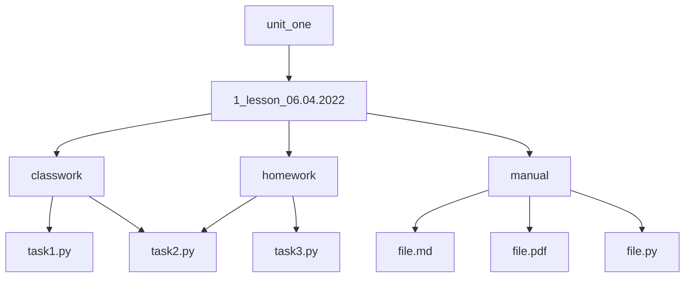

# Алгоритмы и структуры данных

```mermaid
graph TD;
    unit_one-->1_lesson_06.04.2022;
    1_lesson_06.04.2022-->classwork;
    classwork-->task1.py;
    classwork-->task2.py;
    1_lesson_06.04.2022-->homework;
    homework-->task2.py;
    homework-->task3.py;
    1_lesson_06.04.2022-->manual;
    manual-->file.md;
    manual-->file.pdf
    manual-->file.py  
```